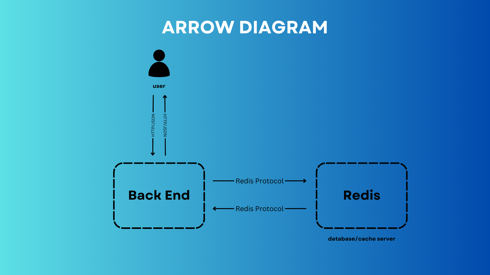

# Fun Words API

A lightweight FastAPI service backed by Redis that serves a random fun word on each request. Perfect for adding a touch of whimsy to your applications or just expanding your vocabulary!

## 📋 Features

- **Random Word Service**: Get a new interesting word each time you hit the API
- **Data Persistence**: All words and current position are stored in Redis and persist across restarts
- **Word Management**: Add new words individually or in bulk
- **API Documentation**: Comprehensive Swagger UI documentation available at `/docs`

## 🏗️ Architecture

The application follows a simple client-server architecture with Redis as a persistent datastore:



**Key Components:**
- **User**: Interacts with the system via HTTP/JSON requests
- **Backend**: FastAPI application that processes requests and manages business logic
- **Redis**: Database/cache server that stores words and state using Redis Protocol

The backend application communicates with Redis using the Redis Protocol (RESP) rather than HTTP/JSON, providing efficient data storage and retrieval.

## 🚀 Getting Started

### Prerequisites

- [Docker](https://www.docker.com/get-started)
- [Docker Compose](https://docs.docker.com/compose/install/)

### Running the Application

1. Clone this repository:
   ```bash
   git clone https://github.com/eliorabaev/DevopsProj.git
   cd fun-words-api
   ```

2. Start the services using Docker Compose:
   ```bash
   docker-compose up -d
   ```

3. The API is now running at [http://localhost:8000](http://localhost:8000)
   - Visit this URL to see a random word

4. API documentation is available at [http://localhost:8000/docs](http://localhost:8000/docs)

## 📝 API Endpoints

### Word Service

| Method | URL | Description | Response |
|--------|-----|-------------|----------|
| GET | `/` | Get a random word | `{"word": "serendipity", "message": "Your fun word is: serendipity!"}` |
| GET | `/words` | Get all words in the database | `{"words": ["word1", "word2", ...], "count": 100}` |
| GET | `/words/reset` | Reset the word counter to start from the beginning | `{"message": "Word index reset successfully"}` |
| POST | `/words/add` | Add a new word to the database | `{"message": "Word 'awesome' added successfully", "index": 100, "total_words": 101}` |
| POST | `/words/add-multiple` | Add multiple words at once | `{"message": "Added 3 new words", "added_words": [...], "total_words": 104}` |

#### Example for adding a word:
```bash
curl -X POST http://localhost:8000/words/add \
  -H "Content-Type: application/json" \
  -d '{"word": "spectacular"}'
```

#### Example for adding multiple words:
```bash
curl -X POST http://localhost:8000/words/add-multiple \
  -H "Content-Type: application/json" \
  -d '{"words": ["fantastic", "incredible", "amazing"]}'
```

### General Data Storage

The API also provides general key-value storage operations:

| Method | URL | Description | Response |
|--------|-----|-------------|----------|
| GET | `/data/{key}` | Get value by key | `{"key": "mykey", "value": "myvalue"}` |
| POST | `/data` | Store a key-value pair | Created item data |
| DELETE | `/data/{key}` | Delete a key | `{"message": "Key deleted successfully"}` |

### Health Check

| Method | URL | Description | Response |
|--------|-----|-------------|----------|
| GET | `/health` | Check if the service and Redis are healthy | `{"status": "healthy", "redis": "connected"}` |

## 💾 Data Persistence

This application uses Redis with persistence enabled:

- Data is persisted to disk using Redis AOF (Append Only File)
- The Redis data directory is mounted as a volume (`./redis-data:/data`)
- Your words and current position will be preserved across container restarts
- Words are only preloaded on first run, not on every restart

## 🔧 Configuration

The application supports the following environment variables:

| Variable | Default | Description |
|----------|---------|-------------|
| REDIS_HOST | redis | Hostname for Redis connection |
| REDIS_PORT | 6379 | Port for Redis connection |

You can modify these in the `docker-compose.yml` file if needed.

## 🛠️ Development

### Project Structure

```
.
├── app/
│   ├── __init__.py
│   └── main.py         # Main FastAPI application
├── docker-compose.yml  # Docker Compose configuration
├── Dockerfile          # Docker build instructions
├── requirements.txt    # Python dependencies
└── README.md           # This documentation
```